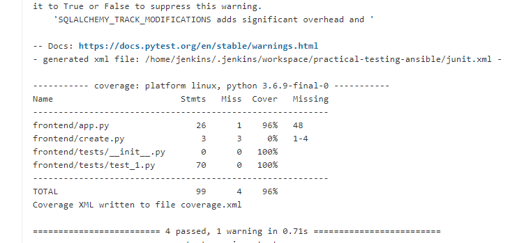

# Practical-project

## Contents
* [Introduction](#introduction) 
  * [Objective](#objective)
  * [Proposal](#proposal)
* [Architecture](#architecture)
  * [Project-tracking](#project-tracking)
  * [Risk Assessment](#risk-assessment)
* [Infrastructure](#infrastructure)
  * [Jenkins Pipeline](#jenkins-pipeline)
  * [Entity-Relationship-Diagram](#entity-relationship-diagram)
  * [Docker-Swarm-Interactions](#docker-swarm-interactions)
  * [Application Services](#application-services)
* [Development](#development)
  * [Front-End Design](#front-end)
  * [Unit Testing](#unit-testing)
* [Footer](#footer)

## Introduction


### Objective

- The objective of this project is to create an application that takes advantage of the idea of Microservices, which is an application architectural style that is highly regarded in the DevOps Ecosystem.

```
The following stack of technology was required for this application:

- Project Management: Kanban Board
- Development: Python, Flask
- Version Control: Git
- CI Server: Jenkins
- Configuration Management: Ansible
- Cloud server: GCP virtual machines
- Containerisation: Docker
- Orchestration Tool: Docker Swarm
- Reverse Proxy: NGINX

```

### Proposal

#### Idea:

- The application is designed to create random matchups that users can use as inspiration when playing fifa against their friends. 


## Architecture

### Project Tracking 

In order to track all the different tasks I needed to complete for this project I used a kanban board. It is freely available online and has a very easy and simple layout that is easy to use. It's a great way to have visual representation of all the tasks needed to complete. 


### Risk Assessment
My risk assessment can be seen below. Risk assessments are crucial to projects to ensure that all potential threats to the success of the project are identified and mitigated.

The rows highlighted in grey are risks I identified at a later stage when the creation of the application had already commenced. 


## Infrastructure 

### **Jenkins Pipeline**

The main focus of the project is on the idea of Continuous deployment, where as new code is developed and pushed up to the central repository. It is automatically tested, built and then deployed to the end user. 

### Stage 1
Perform Tests:

- Unit tests are performed on each individual service to make sure they are functioning correctly. 

The following are lines of code used to run tests for each service. 
```
#test frontend 
python3 -m pytest frontend  --cov=frontend  --cov-report term-missing --cov-report xml --junitxml junit.xml 

#test backend 
python3 -m pytest backend  --cov=backend  --cov-report term-missing --cov-report xml --junitxml junit.xml

#test backend-country
python3 -m pytest backend-country  --cov=backend-country  --cov-report term-missing --cov-report xml --junitxml junit.xml

#test backend-numbers
python3 -m pytest backend-numbers  --cov=backend-numbers  --cov-report term-missing --cov-report xml --junitxml junit.xml


```
### Stage 2 
Install Docker: 
- The second stage is to install docker on the VM where Jenkins is operating from and add jenkins to the docker group, giving it the ability to run commands it otherwise would not be able to, as permission would be denied. 

### Stage 3 & 4 
Build/Push:
- The next two stages are designed to build docker images for each service using my ***docker-compose.yaml*** file that specifies all the relevany information for each images.

- The images are then pushed up to my dockerhub account where they are saved as public registries, so that they can be used for the next steps of my pipeline. 

- Jenkin's credential system is used to refer to my dockerhub details, allowing them to be used securely.  


### Stage 5 
Install Ansible: 

- Stage 5 involves installing ansible on the Jenkins server so that I am able to configure my swarm-manager and swarm-worker VM's with the right requirements using Jenkins.

### Stage 6
Ansible configuration:
- Using a ***playbook.yaml***, ***inventory.yaml*** and ***roles***, all the relevant dependencies are installed for each VM that will be a part of my docker swarm. 
- The swarm manager is set up. 
- The swarm workers are set up. 
- Nginx server is set up and reloaded with the right information in its ***nginx.conf***.

### Stage 7
Deployment:
-Jenkins will copy the ***docker-compose.yaml*** file over to the swarm-manager and then run the docker stack deploy command to deploy the app to all VM in the swarm. 

### **Entity-Relationship-Diagram** 


### **Docker-Swarm-Interactions** 
Through the use of Docker Swarm, a container orchestration tool. A network is created for our virtual machines to host the application amongst one another. The user is then able to connect to the application by visiting the nginx VM URL on their browser. The nginx VM has nginx installed on it with the correct configuration file that allows it to act as a reverse proxy. 

Making sure that users only access the application through the nginx server adds another layer of safety and protection. The application itself is one step further from the user preventing any issues from occuring if this wasn't the case.


### **Application services** 


In regards to this project, the application makes use of 4 services. Comprising of a **Frontend** service that communicates with the other three. The front end service sends HTTP **GET** requests to first the **Backend-country** api and then **Backend-numbers** api to get the country chosen and the numbers for the two players respectively.The information is then added to a dictionary which is then converted and sent to the last api **Backend** via a HTTP **POST** request. The **Backend** api then makes use of thr information received to produce and output based on the logic coded in this service.
 

```
Service 1 [Frontend] : Displays the most recent matchup that has been created as well as the last 5 matchups that were generated. 

Service 2 [Backend-numbers]: Generates two individual numbers that are then assigned to player 1 and player 2.

Service 3 [Backend-country]: Picks between a list of the countries that are home to the top 5 football leagues in the world. 

Service 4 [Backend]: The final service creates the fifa matchup that will be displayed on service 1 based on information from service 2 and service 3.

```


## Development 

### **Version 1**
 
When the user navigates to the default port for my nginx GCP VM ( port:80 ), the frontend HTML page is displayed.

The user is shown the most recent fifa matchup that has been generated, aswell as the last 5 different matchups that were added to the database. 

The user is also given the option to press a button that generates a new matchup on the HTML page. 

### **Unit-Testing** 

- Due to the application being designed in a microservice architecture. Individual unit tests are created for each service. Where the routes for each service are tested seperately. 
- Jenkins will automatically run tests when new code is pushed into the central repository as the pipeline is connected via webhook.





### Refactoring 

### 1.
- Initially, when I had just changed from a monolithic application to one consisting of 3 services, where the last two services were combined. I intially created a deploy.sh file that manually built the images and set up the network and containers. 
```
#!/bin/bash

#Build frontend image 
docker build -t frontend frontend

#Build backend_api images
docker build -t backend-country-api backend-country
docker build -t backend-api backend

#Create network 
docker network create fifa_matchup_network


#Run containers 

docker run -d -p 5000:5000 --name frontend --network fifa_matchup_network frontend
docker run -d --name backend-country-api --network fifa_matchup_network backend-country-api
docker run -d --name backend-api --network fifa_matchup_network backend-api


```
- As the project progressed further , these manual commands were replaced with a docker-compose.yaml file that would create all the images and then other scrips were created to be implemented in the pipeline so that all stages are automated. This deploy.sh file is no longer needed.

```
version: '3.8'
services:
  frontend:
    container_name: 'frontend'
    image: henil13/frontend
    build: ./frontend
    deploy:
      replicas: 2
    environment: 
      DATABASE_URI: ${DATABASE_URI}
    ports:
    - published: 5000
      target: 5000
  backend-country:
    container_name: 'backend-country'
    image: henil13/backend-country
    build: ./backend-country 
    deploy:
      replicas: 2  

```
### 2. 
- The information being received by the frontend from the two services it sent **GET** requests to was in the form of text. Which made it difficult to send both peices of information to the **backend** api in this form. 
- In order to overcome this obstacle, "jsonify" was imported from the flask module so that data return to the frontend would be in the form of JSON objects which could then be combined to send to the last service. 


## Footer 

### Future Improvements:

- Nginx load balance 
- Create database container with volume attached to secure data beingn held 
- Improve design of frontend.
- Include ability to generate random teams depending on how many users are playing fifa. 
- Append database security.

### Acknowledgements:

[Oliver Nichols](https://github.com/OliverNichols)


 